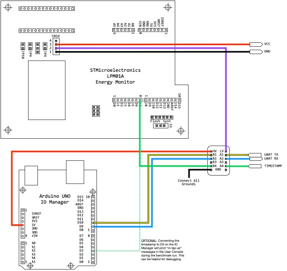
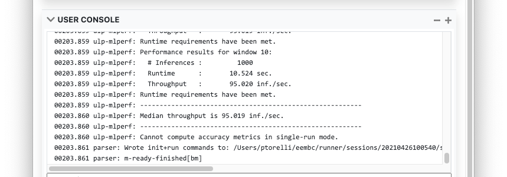

# Table of Contents

* [Introduction](#introduction)
    * [Links](#links)
    * [Current Status](#current-status)
    * [Performance Mode vs. Energy Mode](#performance-mode-vs-energy-mode)
* [Hardware Setup](#hardware-setup)
    * [Performance Mode Hardware](#performance-mode-hardware)
    * [Energy Mode Hardware](#energy-mode-hardware)
* [Software Setup](#software-setup)
    * [Download and Start the Host UI Runner](#download-and-start-the-host-ui-runner)
    * [Selecting Performance Mode](#selecting-performance-mode)
    * [Selecting Energy Mode](#selecting-energy-mode)
* [Custom Configuration](#custom-configuration)
* [Debugging Device Auto-detection](#debugging-device-auto-detection)
* [Bill of Materials](#bill-of-materials)

# Introduction

This is the benchmark runner for ULPMark&trade;-ML and tinyMLperf. It is used to collect performance, accuracy, and energy metrics from a device that complies with the firmware from both projects. EEMBC's firmware can be found [here](https://github.com/eembc/testharness-ulpmark-ml), and tinyMLPerf's reference submissions are [here](https://github.com/mlcommons/tiny/).

## Links

### Runner Binaries

Since the runner binaries are over the GitHub limit, they are now hosted off GitHub at the following links:

* [Windows 10](https://www.eembc.org/ulpmark/runner/win10.7z)
* [macOS](https://www.eembc.org/ulpmark/runner/macos.dmg)
* [Linux](https://www.eembc.org/ulpmark/runner/linux.tar.gz)

The latest version is 3.0.1 uploaded on 09-APR-2021 at about 10:11AM PST.

### Tutorial Videos & Slides

There are also two videos to accompany the energy measurement process. [Part one](https://www.youtube.com/watch?v=4Tvf-GnYHoc) explains how to connect the hardware described in this document. [Part two](https://www.youtube.com/watch?v=fUmDLY7MJxQ) explains how to use the runner to make an energy measurement.

Training slides are also available in the `docs` folder.

## Current Status

* Awaiting feedback on AUC settings and final validation datasets

## Performance Mode vs. Energy Mode

Throughout this document, you will see constant distinctions made between *performance* mode and *energy* mode. The reason why the two collection modes have been separated is due to how the device under test, aka the DUT, behaves in both modes.

The DUT differs like this:

| Performance Mode             | Energy Mode                        |
| ---------------------------- | ----------------------------       |
| Connects to Host PC          | Electrically isolated from Host PC |
| Talks directly to the Runner | Talks directly to IO Manager       |
| Baud rate can be changed     | Baud rate fixed at 9600            |
| Timestamp is an MCU counter of at least 1kHz (1000us)  | Timestamp is GPIO falling-edge with 1us hold-time |

Because of these key differences, two different plug-ins are provided in the "Benchmarks and Test Scripts" drop-down, one for each of the two modes.

It not possible to switch modes dynamically because some UARTs cannot change baud on the fly. Future versions of the benchmark will support alternate solutions for changing modes, but for now it requires a recompilation of the firmware and use of a `#define EE_CFG_ENERGY_MODE 1` to switch.

# Hardware Setup

## Performance Mode Hardware

Port the firmware to your device from the test harness based on the EEMBC ULPMark-ML [test harness sample code](https://github.com/eembc/testharness-ulpmark-ml), or the [MLCommons tinyMLPerf reference code](https://github.com/mlcommons/tiny/tree/master/v0.1). Both sample templates are un-implemented, but provide the same serial monitor interface.

Compile as `EE_CFG_ENERGY_MODE 0` (see the `#define` in `monitor/th_api/th_config.h` or `api/submitter_provided.h`). Program the `th_timestamp` function to return the current microseconds since boot time (e.g., with a MCU counter or system timer).

Connect the DUT to the system with a USB-TTL or USB-debugger cable so that it appears as serial port to the system at 115200 baud, 8N1. (If using a faster Baud rate, see the configuration section at the end of this document.) To verify this step, you should be able to open a terminal program (such as PuTTY, TeraTerm or the Arduino IDE Serial Monitor), connect to the device, and issue the `name%` command successfully.

Proceed to "Software Setup" below.

**ProTip**: Only attempt this if you are very comfortable with the process. It is possible to run performance mode at a higher baud rate. This may be desirable to speed up downloading of the images. For this to work, change the DUT default baud rate from 115200 to the new value, and then edit the `.eembc.ini` file `dut-baud` to match. Instability may occur at higher rates however depending on your OS and hardware. Also note that if you change the default baud in the `.eembc.ini` file, the framework will no longer detect the energy monitor or IO Manager, so be sure to set it back to run in Energy Mode!

## Energy Mode Hardware

Port the firmware to your device from the test harness based on the EEMBC ULPMark-ML [test harness sample code](https://github.com/eembc/testharness-ulpmark-ml), or the [MLCommons tinyMLPerf reference code](https://github.com/mlcommons/tiny/tree/master/v0.1). Both sample templates are un-implemented, but provide the same serial monitor interface.

Compile as `EE_CFG_ENERGY_MODE 1` (see the `#define` in `monitor/th_api/th_config.h` or `api/submitter_provided.h`). Program the `th_timestamp` to generate a falling edge on a GPIO that lasts at least one microsecond (hold time).

Since Energy Mode supplies power to the device at a different voltage than the host USB, we need to electrically isolate the DUT. This is accomplished through two pieces of hardware: 1) three level shifters (one each for UART-TX, UART-RX and GPIO timestamp), an Arduino Uno. The Uno is referred to as the "IO Manager" and provides a UART passthrough to/from the host Runner.

The IO Manager is a simple Arduino UNO. Using the Arduino IDE to flash the `io-manager_1.0.3.hex` image, like so:

~~~
C:\dev\arduino\1.6.6\hardware\tools\avr\bin\avrdude.exe -CC:\dev\arduino\1.6.6\hardware\tools\avr\etc\avrdude.conf -v -patmega328p -carduino -PCOM3 -b115200 -D -Uflash:w:io-manager_1.0.3.hex:i
~~~

The recommended level shifters are the 4-channel BSS138 devices, as sold by [AdaFruit](https://www.adafruit.com/product/757). Simply plug these into a breadboard, provide 5V on the high-side voltage from the Arduino, and VCC from another power supply. This LevelShifter VCC must match the GPIO output of the DUT.

The Runner supports three different energy monitors, aka *EMON*:

1. [STMicroelectronics LPM01A](https://www.st.com/en/evaluation-tools/x-nucleo-lpm01a.html), firmware version 1.0.6 or later required
2. [Joulescope JS110 plus a low-noise power supply](https://www.joulescope.com/products/joulescope-precision-dc-energy-analyzer)
3. [Keysight N6705](https://www.keysight.com/en/pd-2747858-pn-N6705C/dc-power-analyzer-modular-600-w-4-slots?cc=US&lc=eng) with 1xN6781+1xN6731 or 2xN6781

Depending on the EMON you use, there are three different Runner schematics.

Below, the LPM01A provides two supplies: measured VOUT (CN14.3) and *un-*measured VDD (CN14.2). VOUT is used to power the device under test only, whereas VDD provides the low-voltage supply to the level shifters because VDD=VOUT. The high-side of the level shifter is provided by the Arduino UNO, which is 5V. This allows the DUT to run at 1.8V to 3.3V, and still be able to talk to the Arduino at 5V. Since low-voltage is supplied by the un-measured source, it does not count toward the joules used by the DUT.

The yellow line is the output of the DUT UART (Tx), which goes into the Arduino UNO Rx. Likewise, the blue line out of the Arduino UNO transmits to the DUT Rx through the level shifter. Same goes for the timestamp. While the source code claims it needs to be an open-drain, push-pull will work as well, since the level shifter essentially converts open drain to push pull. Pin D7 of the LPM01A listens for falling edges and logs a timestamp.

Below we see the connectivity to the reference platform, the Nulceo L4R5ZI, which uses the Nucleo 144 board schematic. Remove the IDD jumper and connect VCC to the left side. The UART pins on the ST-LINK header are the default mbed-os UARTTX and UARTRX pins. (Note: the labels don't quite make sense, as RX is connected to UARTTX, and vice versa for TX.) The timestamp should be a `DigitalOut`, and D7 is common for all mbed-os boards that support the Arduino interface. Lastly, there are many grounds on the board, pick one.

For debug purposes, the timestamp can also be sent to the Arduino D3 pin. This will cause additional timestamp information to be printed in the log as `io: m-lap-us-\d+`. This can be helpful if there are timestamp issues.

If you do not have firmware version 1.0.6 on your LPM01A (it prints the version on the LCD while booting), you can [download it here](https://www.st.com/content/st_com/en/products/development-tools/software-development-tools/stm32-software-development-tools/stm32-utilities/stm32-lpm01-xn.html). It requires the ST CubeMXDeFuse application as well to perform the upgrade (see [instructions](https://www.st.com/resource/en/user_manual/dm00418905-getting-started-with-powershield-firmware-stmicroelectronics.pdf) that come with the firmware).

For the JS110, [use this schematic](img/hookup-js110.png), and for the N6705, [this one](img/hookup-n6705.png). The concept is the same, the only differences are in where the VOUT and VDD are sourced, and how the timestamp is routed. For the N6705, the timestamp is split into the Arduion UNO. This is done because the N6705 cannot generate it's own timestamps; instead it is synched to the UNO which provides them. For the LPM01A & JS110, the timestamp doesn't need to be connected to the UNO, but it can be to help provide additional debug info (as the UNO will announce it saw a timestamp, which can be helpful if your EMON doesn't seem to be listening).

**IMPORTANT NOTE: Only ONE power supply is allowed to supply the DUT during measurement.** Any additional circuitry on the board will contribute to power and lower the score. The run rules allow cutting traces, desoldering bridges, removing jumpers or setting switches to disable ancillary hardware on the platform (e.g., debug hardware, or kit sensors).

To assist in making the setup more compact, EEMBC provides a link to an [Arduino shield](https://www.eembc.org/iotmark/index.php#framework) for faster connectivity.

See the "Bill of Materials" section at the end of this file for more information on where to buy all the parts shown above.

For first-time setup, it really helps to have a small logic analyzer or a digital oscilloscope to help trace the output of the DUT at various stages of the isolation path. For example, is the Rx transmission from the host making it to the UART input? Is the boot message from the DUT coming from the right TX pin on the header? Is the timestamp held low long enough?

Proceed to "Software Setup" below.

# Software Setup

## Download and Start the Host UI Runner

This is a very brief user guide for booting the framework and testing connectivity.

There are three OS release: Mac Big Sur / Catalina, Ubuntu 18.04 (probably works on 20.04), and Win10. The macOS version is provided as a \*.app file. Linux and Windows are provided as zip-files. Open the application by double-clicking the icon in macOS, running `EEMBC Benchmark Framework.exe` in windows, or `benchmark-framework` in Linux. if everything booted properly this window appears:

When the Host UI Runner first boots, it creates two things: an initialization file in `$HOME/.eembc.ini`, and directory structure to store benchmark input (such as datasets for inference) and output data (such as session logs from previous runs). By default, this is created under `$HOME/eembc`, but can be changed in the INI file, explained at the end of this document.

## Selecting Performance Mode

Under the `Benchmarks and Test Scripts` panel, choose one of the two benchmark modes. We'll start with `ML Performance`. A configuration panel will appear:

Take note of the directory (in red) in the center of the screen. This is a work directory that has been created. Copy the `datasets` folder from this repository into this folder. There is a README in this repositories dataset folder explaining the file formats.

**The Runner will look in the subfolder defined in the firmware, and can be checked with the `profile%` command.**

Also note that the application was started with a Performance Mode DUT plugged in, and it shows up as a macOS serial port.

If you see warnings about missing VISA drivers, ignore them. (The code supports VISA test hardware, but it is irrelevant for performance testing. If the VISA scan takes too long, refer to the configuration options at the end of this document.)

Click `Initialize` under the benchmark section and the runner will mount the device and handshake. At this point, you can issue commands to the DUT by typing `dut <command>` in the User Console input line. Also note that the model name in the configuration panel has been set to `ic01`. Handshaking with the DUT causes the DUT to print a special query message alerting the runner of the correct model inputs to use.

At this point, clicking `Run` will download the first binary input to the DUT using the `db` commands (as stated above, depending on the mode) and collect a timing score. The difference between the two `m-lap-us` statements is the # of microseconds elapsed. The value will depend on the resolution of the timer implemented on your DUT.

Running too few iterations will result in a low performance number if the device is fast. Try increasing the number of run iterations to see if the performance increases.

Selecting "Benchmark" mode runs 5 different input files and takes the median of the inferences/second metric:

## Selecting Energy Mode

Under the `Benchmarks and Test Scripts` panel, choose one of the two benchmark modes. We'll start with `ML Energy`. A configuration panel will appear that looks identical to the `ML Performance` panel, except multiple input mode has been removed. At 9600 baud, this would take a very long time, it is easier to just compile for performance mode when running full validation.

Plug in the Energy Monitor (EMON) and the IO Manager, it should look like this:

Two devices appear, the EMON and the IO Manager. If you are using a JS110 or N6705, they will also appear. The system will use the first EMON it sees unless you disable it with the toggle buttons.

Click `Initialize` under the benchmark section and the runner will mount the device and handshake. If you click on the "+" sign in the upper-right of the User Console, and grow the window, it should look something like this:

The colors indicate which device is talking. Green is the IO Manager, Tan is the EMON, and Blue is the DUT. A lot of synchronized communcaiton is required to perform a simple handshake!

Unlike Performance Mode, you cannot talk directly to the DUT right now because it is powered down. To issue a DUT command, scroll down to the EMON control panel, turn on the power, and then issue `io dut <command>`. The `io` prefix is necessary because you are sending the command to the IO Manager, which then passes it down to the DUT at the correct voltage.

At this point, clicking `Run` will the first binary input to the DUT using the `db` commands (as stated above, depending on the mode) and collect a timing score. When it completes, an energy window will pop up at the bottom of the screen, like this:

Each time a run completes successfully a new EMON window pops up; close them with the "x" in the upper-right corner. The User Console will indicate the energy and power in between the timestamps (plus a small time buffer of a few hundred microseconds to make sure we're in the middle of the run).

If running in Benchmark mode, you will see the median score of 5 energy runs:

# Custom Configuration

The default behavior of the runner can be modified with an initialization file. On startup, the Runner will create a default `.eembc.ini` in your home directory. On Linux and macOS this is `$HOME`, on Win10 it is `%USERPROFILE%`.

~~~
% cat $HOME/.eembc.ini
root=/Users/ptorelli
dut-baud=115200
dut-boot-mv=3000
default-timeout-ms=5000
emon-drop-thresh-pct=0.1
timestamp-hold-us=50
umount-on-error=true
use-crlf=false
use-visa=true
n6705-set-vio=true
~~~

These three are most relevant for the ML effort:

* `root` changes where the Runner looks for input files, and saves output sessions.

* `dut-baud` sets the default Baud rate for serial detection in performance mode. This also controls the baud rate to the IO Manager. **USE CAUTION** If you change this from 115200 and forget to change it back, the framework won't detect the IO Manager! This is only for direct-connection of the DUT.

* `dut-boot-mv` selects the voltage used while querying the device on initialization (prior to making the EMON voltage setting available to the user).

Other settings are listed here for the sake of completeness:

* `default-timeout-ms` is the default timeout value for unspecified asynchronous scripting.

* `emon-drop-thresh-pct` is the maximum number of dropped samples allowed for slow EMON connections.

* `timestamp-hold-us` is the number of microseconds to filter noisy timestamps

* `umount-on-error` causes all devices to un-mount if there is an error, forcing re-initialization

* `use-crlf` prints CRLF at the end of all log file messages, rather than a single LF.

* `use-visa` enables/disables communication with the VISA drivers on the system. Some drivers are quite slow to detect, and if no VISA devices are used, it can speed the Runner boot-time by disabling this.

* `n6705-set-vio` enables/disables automatically setting the IO channel of the N6705. This may be necessary if the MCU board-input voltage differs from the GPIO voltages due to an intermediate SMPS/LDO.

# Debugging Device Auto-detection

When the Runner boots, it scans all of the scans all the serial ports searching for compatible firmware. During performance mode, it does this by sending the `name%` command and waiting up to 2 seconds for the port to respond with `m-ready`. If successful, the device will appear in the device console. If it does not show up, it could be due to the following:

1. The Runner's default baud rate does not match the device's baud rate; make sure the baud rates are the same
2. The device took too long to reply; minimize the amount of code executing between power-on and `m-ready`.
3. The USB subsystem did not initialize before the plug-in event was sent; exit the runner, plug the device in, restart the runner

Also, every time a USB device changes, the system needs to perform a scan for a long list of hardware. If you have many USB devices connected to your system and this is taking a long time, it is recommended to not swap USB devices while running. Making this worse, some OSes report the USB change notification before the drivers are loaded and the device has booted, which leads to a timeout and "No compatible devices detected."

**TL;DR**: Sometimes a device is not detected when hot-plugged. The solution is to plug in all devices first, wait a few seconds for your device to boot, and then start the runner.

# Bill of Materials

| Component | Product | Links |
| --------- | ------------------- | ---- |
| Energy Monitor (50mA max.)     | STMicro. LPM01A (v1.0.6)    | [STM](https://estore.st.com/en/products/evaluation-tools/product-evaluation-tools/stm32-nucleo-expansion-boards/x-nucleo-lpm01a.html) - [Farnell](https://www.newark.com/stmicroelectronics/x-nucleo-lpm01a/expansion-board-nucleo-32-64-144/dp/44AC3406?ost=X-NUCLEO-LPM01A&CMP=GRHS-1000962) - [Mouser](https://www.mouser.com/ProductDetail/STMicroelectronics/X-NUCLEO-LPM01A/?qs=%2Fha2pyFadugfOa1q%2FRFISd3pf2z%2FxKPjQJCUXEGZ3O92Zryk8%2FG3oQ%3D%3D) |
| Level Shifter | BSS138 x4 | [Adafruit](https://www.adafruit.com/product/757) - [Digikey](https://www.digikey.com/en/products/detail/adafruit-industries-llc/757/4990756) |
| IO Manager | Arduino UNO | [Arduino](https://store.arduino.cc/usa/arduino-uno-rev3) - [DigiKey](https://www.digikey.com/en/products/detail/arduino/A000066/2784006) |
| Breadboard | Pololu 400pt | [Pololu](https://www.pololu.com/product/351) - [Digikey](https://www.digikey.com/en/products/detail/pololu-corporation/351/11586984) |
| Hookup Wires | E-Z-Hook | [E-Z-Hook](https://e-z-hook.com/test-leads/pins-plugs-sockets/9110-square-0-025-inch-socket-with-heat-shrink-22-awg-pvc-test-lead-jumper/) - [DigiKey](https://www.digikey.com/en/products/detail/e-z-hook/9110-6-S/2603112) |
| Headers (extra tall) | Samtec Inc. | [Samtec](https://www.samtec.com/products/mtsw-110-09-s-s-330) - [DigiKey](https://www.digikey.com/en/products/detail/samtec-inc/MTSW-110-09-S-S-330/8162605) |

# Copyright License

This software is the copyright of EEMBC, and is currently released under Apache 2.0.
